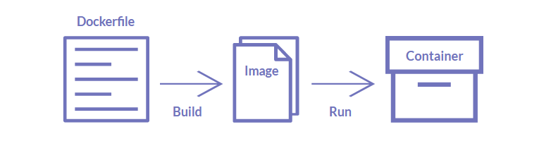

# INCEPTION

Broaden knowledge of system administration by using Docker.
Virtualize several Docker images and set up a small infrastructure composed of different services. Each service has to run in a dedicated container.

## Table of contents
 1. [Docker basics](#docker-basics)
	- [Dockerfile](#dockerfile)
	- [Images](#images)
	- [Containers](#containers)
	- [Docker compose](#docker-compose)
	- [Docker CLI basic commands](#docker-cli-basic-commands)
	- [Questions](#questions)
 2. [Services](#services)
	- [NGINX with TLSv1.3](#nginx-with-tlsv13)
		- [Dockerfile](#dockerfile-1)
		- [nginx.conf](#nginxconf)
		- [Documentations](#-8)
	- [WordPress + php-fpm](#)
	- [MariaDB](#)
 3. [Volumes]()
	- [WordPress database]()
	- [WordPress website files]()
4. [Docker Compose]()
5. [Docker network]()
6. [Makefile]()

# Docker basics
Docker provides the ability to package and run an application in an isolated environment called a **container**. Containers are lightweight and contain everything needed to run the application.

Docker is a tool that is used to automate the deployment of applications in lightweight containers so that applications can work efficiently in different environments in isolation.

## Dockerfile
A Dockerfile is a text document that contains instructions for generating a Docker **image**.

It define the steps needed to create the image and run it. Each instruction create a layer in the image. That includes all the files, binaries, libraries, and configurations to run a container.

It is the source code of the image.

### Basic instructions

 - **`FROM`** `<image>[:<tag>]` 
It defines the base image. Docker applies the remaining instructions in your Dockerfile on top of the base image. 
A valid Dockerfile must start with a `FROM` instruction. The image can be any valid image.

- **`RUN`** `<command>` 
Runs a command within the container. This can be any command available in the container's environment. This create a new layer on top of the current image.

- **`COPY`** `<src> <dst>` 
Copies new files or directories from `<src>` and add them to the filesystem of the container at the path `<dst>`.

- **`EXPOSE`** `<port>` 
Informs Docker that the container listens on the specified network ports at runtime. It doesn't actually publish the port. It functions as a type of documentation.

- **`ENTRYPOINT`** `["executable", "param1", "param2"]` 
Defines the program or script that will be executed when the containers starts.

 - **`CMD`** `["cmd", "arg", "..."]`  
Sets the command to be executed when running a container from an image.

A container runs as long as its main process runs, so it is necessary for Docker to run processes in foreground to ensure the process doesn't exit immediately. 
By default, Docker containers are designed to run a single application or service. If the main process of that application or service stops, there is nothing left for the container to do, so it exits.

The container's lifecycle is tied to the main process specified in the `CMD` or `ENTRYPOINT` instruction of the Dockerfile.

[(Dockerfile reference)](https://docs.docker.com/reference/dockerfile/)

## Images
An image is a read-only template with instructions for creating a Docker container.

Docker Image is an executable package of software that includes everything needed to run an application. This image informs how a container should instantiate, determining which software components will run and how.

Base Image: The foundational layer, often a minimal OS or runtime environment. 
Layers: Immutable filesystem layers stacked to form a complete image.

### Images are :
 - **Immutable**. Once an image is created, it can't be modified. You can only make a new image or add changes on top of it.
 - **Composed of layers**. Each layer represented a set of file system changes that add, remove, or modify files.

## Containers
A container is a runnable instance of an image.

You can connect a container to one or more networks or attach storage to it. A container is defined by its image as well as any configuration options you provide to it when you create or start it.

Best practice for containers is that each container should do one thing and do it well.

### Containers are :
 - **Self-contained**. Each container has everything it needs to function with no reliance on any pre-installed dependencies on the host machine.
 - **Isolated**. Since containers are run in isolation, they have minimal influence on the host and other containers, increasing the security of your applications.
 - **Independent**. Each container is independently managed. Deleting one container won't affect any others.
 - **Portable**. Containers can run anywhere.

### Containers VS VMs
A VM is an entire operating system with its own kernel, hardware drivers, programs and applications. A container is simply an isolated process with all the files is need to run.

## Docker compose
With Docker Compose, you can define all of your containers and their configurations in a single YAML file.

You don't always need to recreate everything from scratch. If you make a change, run *docker compose up* again and Compose will reconcile the changes in your file and apply them intelligently.

Docker Compose manages multi-container setups and networking.

### Dockerfile VS Compose file
A Dockerfile provides instructions to build a container image while a Compose file defines your running containers. Quite often, a Compose file references a Dockerfile to build an image to use for a particular service.

## Docker CLI basic commands

<strong>Images</strong>

 - List images 

		$ docker images
 - Remove an image

		$ docker rmi [ID]
 - Remove all images

		$ docker rmi -f $(docker images -qa)

<strong>Containers</strong>

 - List containers

		$ docker ps -a
 - Stop container

		$ docker stop [ID]
 - Stop all containers

		$ docker stop $(docker ps -qa)
 - Remove container

		$ docker rm [ID]
 - Remove all containers

		$ docker rm $(docker ps -qa)
 - Execute a command in a container

		$ docker exec [ID] [cmd] [args]

<strong>Volumes</strong>

 - List volumes

		$ docker volume ls
 - Remove a volume

		$ docker volume rm [ID]
 - Remove all volumes

		$ docker volume rm $(docker volume ls -q)

<strong>Networks</strong>

 - List networks

		$ docker network ls
 - Remove a network

		$ docker network rm [ID]
 - Remove all networks

		$ docker network rm $(docker network ls -q)

[(Docker CLI commands reference)](https://docs.docker.com/reference/cli/docker/)

##
##
## Questions
#### How Docker work ?
#### How docker compose work ?
#### Difference between a Docker image used with docker compose and without ?
#### Benefit of Docker compared to VM ?
#### Pertinence of the directory structure ?

##
##

# Services

The containers must be built either from the penultimate stable version of *Alpine* or *Debian*. 

## NGINX with TLSv1.3

Subject : A Docker container that contains NGINX with TLSv1.2 or TLSv1.3 only

### Dockerfile

	FROM debian:stable

	RUN apt update -y && apt install -y nginx openssl
	RUN openssl req -x509 -nodes -days 365 -newkey rsa:2048 \
		-keyout /etc/ssl/private/private.key \
		-out /etc/ssl/certs/certificate.crt \
		-subj "/C=/ST=/L=/O=/OU=/CN="

	COPY ./conf/nginx.conf /etc/nginx/nginx.conf

	EXPOSE 443

	CMD ["/usr/sbin/nginx", "-g", "daemon off;"]

#### Base image

Specifies the base image for the Docker container.

#### Install `nginx` and `openssl`

`apt update` : Update available packages.

`apt install nginx openssl` : Install *nginx*, a web server, and *openssl* to generate numeric certificates to securise communications with TLSv1.3.

`-y` : Used to automatically answer 'yes' to all prompt during the execution of the command and avoid manually confirming each action.

#### Generate certificates for TLS

TLS (Transport Layer Security) is a protocol designed to provide secure communication over networks. It is used to ensure privacy, data integrity and authentication between to communication applications.

##

 - Purposes of TLS :

It encrypts the data between two parties, ensuring that it can't be read by anyone else. This protects sensitive information from being intercepted and understood by unauthorized entities.

It ensures that the data sent and received has not been altered during transit. Any unauthorized modifications to the data will be detected.

It allows the client to verify the identity of the server. It ensures the client is communicating with the intended server and not an imposter.

 - How it works ?

The initial process between the client and server exchange cryptographic keys and agree on the encryption methods to be used.

The client and the server send messages to each other that contain information about the supported encryption algorithms and session keys.

The server sends its digital certificate to prove its identity.

A session key is generated and securely exchange  between the client and server, which will be used to encrypt the data during the session.

Once the initial process is complet, all communication between the client and server is encrypted usinf the session key.

##

Generate certificates to use TLS protocol :

`openssl req -x509 -nodes -days 365 -newkey rsa:2048 -keyout /etc/ssl/private/private.key -out /etc/ssl/certs/certificate.crt -subj "/C=/ST=/L=/O=/OU=/CN="`

`openssl` is a cryptography toolkit implementing the TLS network protocol and related cryptography standards required.

`req` : certificate signing request 
`-x509` : outputs a self signed certificate instead of a certificate request 
`-nodes` : (no DES) not encrypt the private key. (don't ask for a password) 
`-days 365` : validity period of the certificate (when *-x509* is being used) 
`-newkey rsa:2048` : (*-newkey rsa:nbits*) generates a new RSA private/public key pair with a length of 2048 bits. 
`-keyout` : path to save the private key 
`-out` : path to save the self-signed certificate 
`-subj "/C=/ST=/L=/O=/OU=/CN="` : replaces subject field of input request with specified data. Avoid prompt asking for certificate informations.

#### Copying nginx configuration file

From local file in `./conf/nginx.conf` 
to `/etc/nginx/nginx.conf` in the container, which is the default path for nginx configuration files.

[nginx.conf details](#nginxconf)

#### Port 443

Documentation on which port need to be expose. 
`443` is the default port for https.

#### Start Nginx in the foreground

As the process must run in the foreground :

`/usr/sbin/nginx -g "daemon off;"`

`/usr/sbin/nginx` : start nginx 
`-g` : set global configuration directives 
`"daemon off;"` : option which tells to Nginx to run in foreground

### nginx.conf

	events {
		worker_connections 1024;
	}
	http {
		server {
			listen 443 ssl;

			server_name bsuc.42.fr;

			ssl_certificate /etc/ssl/certs/certificate.crt;
			ssl_certificate_key /etc/ssl/private/private.key;

			ssl_protocols TLSv1.3;

			location ~ \.php$ {
				fastcgi_pass wordpress:9000;
				fastcgi_index index.php;
				include fastcgi_params;
				fastcgi_param SCRIPT_FILENAME /var/www/html$fastcgi_script_name;
				fastcgi_param PATH_INFO $fastcgi_path_info;
			}

			location / {
				root /var/www/html;
				index index.php;
			}

			location = /favicon.ico {
				log_not_found off;
			}
		}
	}

#### `events`

This block configure how Nginx handles connections.

`worker_connections` : sets maximum number of simultaneous connections that each worker process can handle.

------

voir cb de worker_processes par defaut 
worker_processes par default = 1 ?

------

#### `http`

This block configure directives for http server and handling web traffic.

#### `server`

This block defines the configuration for a server.

`listen 443 ssl;` : makes the server listen on port 443 for https connection, with ssl enabled.

`server_name login.42.fr;` : specifies the server's domain name.

`ssl_certificate /etc/ssl/certs/certificate.crt;` : specifies the path to the ssl certificate file. 
`ssl_certificate_key /etc/ssl/private/private.key;`: specifies the path to the ssl certificate's private key file.

`ssl_protocols TLSv1.3;` : specifies the SSL/TLS protocols to use.

`location ~ \.php$ {}` : this block defines how to process PHP files.

`fastcgi_pass wordpress:9000;` : sets the FastCGI server to handle PHP requests. 
`fastcgi_index index.php;` : specifies the default file to be served. 
`include fastcgi_params;` : includes the defaults FastCGI parameters provided by Nginx. 
`fastcgi_param SCRIPT_FILENAME /var/www/html$fastcgi_script_name;` : sets the `SCRIPT_FILENAME` parameter to tell FastCGI where the PHP scripts are located. 
`fastcgi_param PATH_INFO $fastcgi_path_info;` :  

`location / {}` :

`root /usr/share/nginx/html;` :  
`index index.html. index.htm;` :  

`location = /favicon.ico {}` :

`log_not_found off;` : 

#
<!-- #### Documentations Nginx & OpenSSL -->

<strong>Documentation Nginx & OpenSSL</strong>

 - [man openssl](https://linux.die.net/man/1/openssl)
 - [man openssl req](https://www.openssl.org/docs/man1.0.2/man1/openssl-req.html)
 - [nginx beginner's guide](https://nginx.org/en/docs/beginners_guide.html)
 - [nginx core](https://nginx.org/en/docs/ngx_core_module.html)

 <!-- - [man openssl](https://linux.die.net/man/1/openssl)
 - [man openssl req](https://www.openssl.org/docs/man1.0.2/man1/openssl-req.html)
 - [nginx beginner's guide](https://nginx.org/en/docs/beginners_guide.html)
 - [nginx core](https://nginx.org/en/docs/ngx_core_module.html) -->

<!-- `listen 443 ssl;` -> indique a nginx d'ecouter sur le port 443 et d'utiliser ssl. 
`server_name localhost;` -> configure nom du server pour cette conf, icic localhost. 
`ssl_certificate /etc/ssl/certs/certificate.crt;` -> Specifie chemin vers le certificat SSL utilise par le serveur.
Emplacement ou on a copie dans le Dockerfile. 
`ssl_certificate_key /etc/ssl/private/private.key;` -> Specifie le chemin vers la cle privee correspondant au certificat SSL definit juste avant.
Emplacement ou on a copie dans le Dockerfile. 
`ssl_protocols TLSv1.3;` -> definit les protocoles SSL/TLS autorises pour les connexions securises. Ici uniquement TLSv1.3. 
`location / {}` -> definit la conf pour requete http entrante sur url correspondant a / 
`root /usr/share/nginx/html;` -> specifie repertoire racine a partir du quel nginx cherche les fichiers a afficher. 
`index index.html. index.htm;` -> fichiers index a afficher par defaut si aucun fichier specifique est demande dans l'url. 

`location = /favicon.ico {
	log_not_found off;
}` -> j'avais une erreur qui apparaissait quand je me connectais a localhost par rapport a favicon.ico, donc pour eviter que cette erreur apparaisse encore j'ai ajouter cette exceptionn.

#

A partir de la on peut faire tourner notre nginx dans le conteneur avec 

`docker build . -t nginx`

pour construire notre image a partid u dockerfile. 
`.` -> emplacement du dockerfile a build 
`-t nginx` -> donner un tag a notre image.

`docker run --name nginx -p443:443 nginx`

`--name nginx` -> on nomme notre container `nginx` 
`-p443:443` -> pour mapper le port du container sur le port hote. Donc le port 443 du container est expose sur notre port 443. 
`nginx` -> l'image a run (dans notre build on l'a nomme nginx avec `-t nginx`).

#

Maintenant notre container run comme il faut.
On peut verifier que les connexion en http (port 80) ne sont pas autorise avec : 
`curl -v http://localhost` -> connection refused 
`curl -v -k https://localhost` -> connexion au port 443 parfait. 
`-k` -> pour ignorer les problemes de certificats qui sont auto-signes. -->

## A Docker container that contains WordPress + php-fpm only

(it must be installed and configured) 
Without nginx

## A Docker container that contains MariaDB only

Without nginx

##

### A volume that contains your WordPress database

### A volume that contains your WordPress website files

### A **docker network** that establishes the connection between containers.

##

 
 

