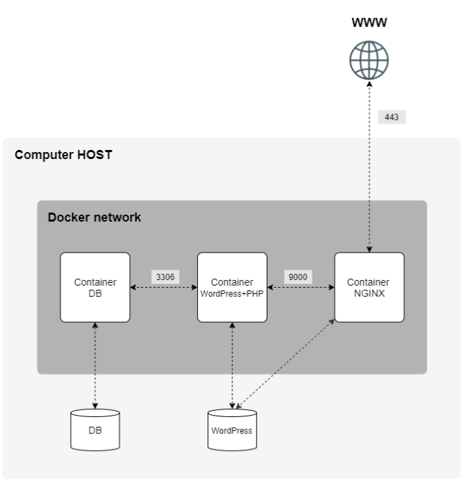

# Inception

Broaden knowledge of system administration by using Docker.
Virtualize several Docker images and set up a small infrastructure composed of different services. Each service has to run in a dedicated container.

## Docker basics
Docker provides the ability to package and run an application in an isolated environment called a container. Containers are lightweight and contain everything needed to run the application.

### Images
An image is a read-only template with instructions for creating a Docker container. 
To build your own image, you create a **Dockerfile** with a simple syntax for defining the steps needed to create the image and run it. Each instruction in a Dockerfile creates a layer in the image. That includes all of the files, binaries, libraries, and configurations to run a container.

#### Images are :
 - **Immutable**. Once an image is created, it can't be modified. You can only make a new image or add changes on top of it.
 - **Composed of layers**. Each layer represented a set of file system changes that add, remove, or modify files.

### Containers
A container is a runnable instance of an image. 
You can connect a container to one or more networks or attach storage to it. A container is defined by its image as well as any configuration options you provide to it when you create or start it. 
Best practice for containers is that each container should do one thing and do it well.

#### Containers are :
 - **Self-contained**. Each container has everything it needs to function with no reliance on any pre-installed dependencies on the host machine.
 - **Isolated**. Since containers are run in isolation, they have minimal influence on the host and other containers, increasing the security of your applications.
 - **Independent**. Each container is independently managed. Deleting one container won't affect any others.
 - **Portable**. Containers can run anywhere.

#### Containers VS VMs
A VM is an entire operating system with its own kernel, hardware drivers, programs and applications. A container is simply an isolated process with all the files is need to run.

### Docker compose
With Docker Compose, you can define all of your containers and their configurations in a single YAML file. 
You don't always need to recreate everything from scratch. If you make a change, run *docker compose up* again and Compose will reconcile the changes in your file and apply them intelligently.

#### Dockerfile VS Compose file
A Dockerfile provides instructions to build a container image while a Compose file defines your running containers. Quite often, a Compose file references a Dockerfile to build an image to use for a particular service.

### Basic command

#### Images
 - List images 
 `$ docker images`
 - Remove an image 
	$ docker rmi [id]

##
##

### How Docker work

### How docker compose work

### Difference between a Docker image used with docker compose and without

### Benefit of Docker compared to VM

### Pertinence of the directory structure

# Services

## A Docker container that contains NGINX with TLSv1.2 or TLSv1.3 only

- [Nginx](./srcs/requirements/nginx/README.md)

## A Docker container that contains WordPress + php-fpm only

(it must be installed and configured) 
Without nginx

- [WordPress + php-fpm](./srcs/requirements/wordpress/README.md)

## A Docker container that contains MariaDB only

Without nginx

- [MariaDB](./srcs/requirements/mariadb/README.md)

##

### A volume that contains your WordPress database

### A volume that contains your WordPress website files

### A **docker network** that establishes the connection between containers.

##

 
 

